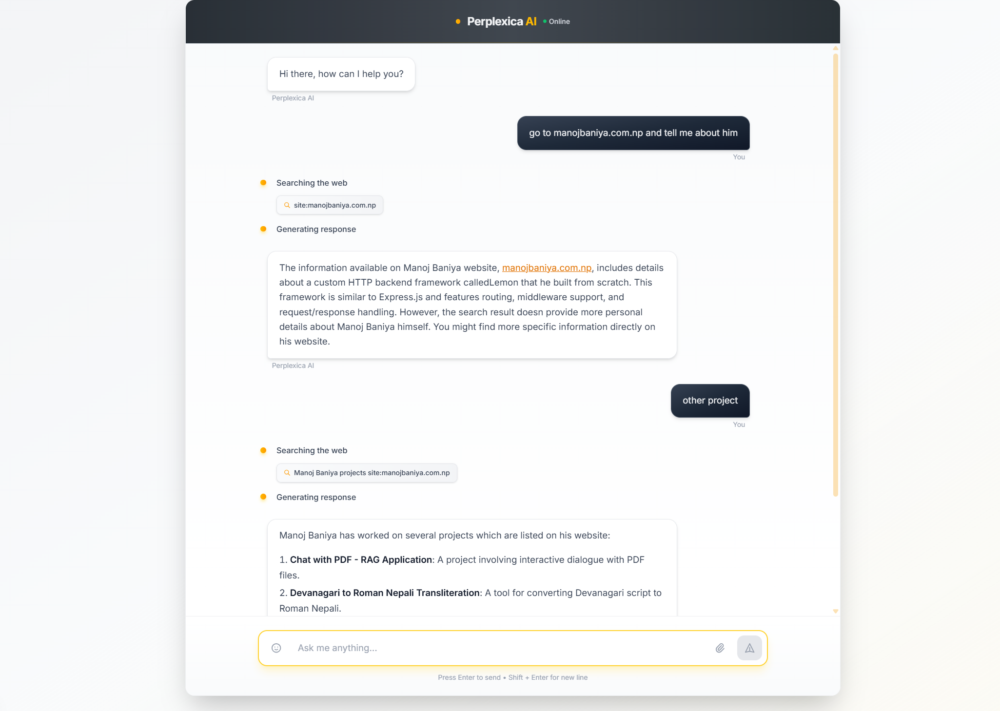
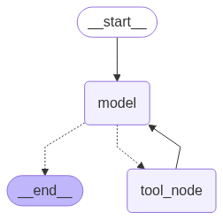

## AI Search Assistant (NEXT JS + LANGGRAPH FAST API)



---

Langgraph Simple LLM with Tool Architecture:



## Quick Start

### Backend Setup (Python)

1. **Open a terminal in the project root directory**
2. **Install dependencies:**

   ```bash
   pip install -r requirements.txt
   ```

3. **Set up environment variables:**

   - Create a `.env` file in the root directory
   - Add your OpenAI API key:

     ```
     OPENAI_API_KEY=your_api_key_here
     TAVILY_API_KEY=your_tavily_api_key_here
     ```

     OR USE LOCAL OLLAMA WITH OPENAI COMPATIBILITY

4. **Start the backend server:**
   ```bash
   python -m uvicorn app:app --port 8000
   ```

The backend will be available at `http://localhost:8000`

### Frontend Setup (Next.js)

1. **Navigate to the web directory:**

   ```bash
   cd web
   ```

2. **Install dependencies:**

   ```bash
   npm install
   ```

3. **Start the development server:**
   ```bash
   npm run dev
   ```

The frontend will be available at `http://localhost:3000`

## API Endpoints

- `GET /health` - Health check endpoint
- `GET /chat_stream/{message}` - Chat streaming endpoint with optional checkpoint_id

## Environment Variables

### Required

- `OPENAI_API_KEY`: Your OpenAI API key for GPT-4 access
- `TAVILY_API_KEY`: Your Tavily API key for web search functionality

## Troubleshooting

### Backend Issues

- Make sure Python 3.8+ is installed
- Ensure all dependencies are installed: `pip install -r requirements.txt`
- Check that your API keys are correctly set in the `.env` file
- Verify the server is running on port 8000

### Frontend Issues

- Ensure Node.js 18+ is installed
- Clear node_modules and reinstall: `rm -rf node_modules && npm install`
- Check that the backend is running before starting the frontend
- Verify the frontend is configured to connect to `http://localhost:8000`

### Connection Issues

- The frontend will show a setup guide if it cannot connect to the backend
- Make sure both frontend and backend are running
- Check for firewall or antivirus blocking the connections
- Verify ports 3000 (frontend) and 8000 (backend) are available

## Development

### Project Structure

```
├── app.py                 # FastAPI backend server
├── requirements.txt       # Python dependencies
├── start-backend.bat     # Windows startup script
├── .env                  # Environment variables (create this)
└── web/                  # Next.js frontend
    ├── package.json
    ├── src/
    │   ├── components/   # React components
    │   ├── hooks/        # Custom React hooks
    │   ├── contexts/     # React contexts
    │   ├── types/        # TypeScript types
    │   └── utils/        # Utility functions
    └── ...
```
